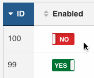
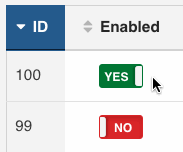
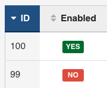

Chapter 4. Customizing the List View
====================================

The first simple backend created with EasyAdmin used a compact configuration
like the following:

```yaml
# app/config/config.yml
easy_admin:
    entities:
        - AppBundle\Entity\Customer
        - AppBundle\Entity\Order
        - AppBundle\Entity\Product
```

When you start customizing the backend, instead of the compact configuration
format, you must use the expanded format:

```yaml
# app/config/config.yml
easy_admin:
    entities:
        Customer:
            class: AppBundle\Entity\Customer
        Order:
            class: AppBundle\Entity\Order
        Product:
            class: AppBundle\Entity\Product
```

This expanded configuration format allows to define lots of attributes for each
entity, as explained the following chapters:

```yaml
# app/config/config.yml
easy_admin:
    entities:
        Customer:
            class: AppBundle\Entity\Customer
            list:
                fields: ['id', 'firstName', 'lastName', 'phone', 'email']
        # ...
```

Refer to the [EasyAdmin Configuration Reference](11-configuration-reference.md)
chapter to check out all the available configuration formats.

Customize the Title of the Page
-------------------------------

By default, the title of the listing page just displays the name of the entity.
Define the `title` option to set a custom page title:

```yaml
# app/config/config.yml
easy_admin:
    entities:
        Customer:
            class: AppBundle\Entity\Customer
            list:
                title: "Most recent customers"
        # ...
```

The `title` option can include the following variable:

  * `%entity_name%`, resolves to the class name of the current entity (e.g.
    `Customer`, `Product`, `User`, etc.)

Beware that, in Symfony applications, YAML values enclosed with `%` and `%`
have a special meaning. Use two consecutive `%` characters to avoid any issue:

```yaml
easy_admin:
    entities:
        Customer:
            class: AppBundle\Entity\Customer
            list:
                title: '%%entity_name%% listing'
        # ...
```

Customize the Number of Item Rows Displayed
-------------------------------------------

By default, listings display a maximum of `15` rows. Define the
`max_results` option under the `list` key to change this value:

```yaml
# app/config/config.yml
easy_admin:
    list:
        max_results: 30
    # ...
```

Customize the Columns Displayed
-------------------------------

By default, the backend makes some "smart guesses" to decide which columns to
display in listings to make them look "good enough". Define the `fields` option
in the `list` configuration of any entity to explicitly set the fields to
display:

```yaml
# app/config/config.yml
easy_admin:
    entities:
        Customer:
            class: AppBundle\Entity\Customer
            list:
                fields: ['id', 'firstName', 'lastName', 'phone', 'email']
    # ...
```

### Virtual Entity Fields

Sometimes, it's useful to display values which are not entity properties. For
example, if your `Customer` entity defines the `firstName` and `lastName`
properties, you may want to just display a column called `Name` with both
values merged. These columns are called *virtual fields* because they don't
really exist as Doctrine entity fields.

First, add this new virtual field (`name`) to the entity configuration:

```yaml
easy_admin:
    entities:
        Customer:
            class: AppBundle\Entity\Customer
            list:
                fields: ['id', 'name', 'phone', 'email']
    # ...
```

Now, if you reload the backend, you'll see that the virtual field only displays
`Inaccessible` as its value. The reason is that virtual field `name` does not
match any of the entity's properties. To fix this issue, add a new public
method in your entity called `getXxx()` or `xxx()`, where `xxx` is the name of
the virtual field (in this case the field is called `name`, so the method must
be called `getName()` or `name()`):

```php
namespace AppBundle\Entity;

use Doctrine\ORM\Mapping as ORM;

/** @ORM\Entity */
class Customer
{
    // ...

    public function getName()
    {
        return $this->getFirstName().' '.$this->getLastName();
    }
}
```

That's it. Reload your backend and now you'll see the right values of this
virtual field. By default, virtual fields are displayed as text contents. If
your virtual field is a *boolean* value or a date, use the `type` option to
set a more appropriate form field to render them:

```yaml
# in this example, the virtual fields 'is_eligible' and 'last_contact' will
# be considered strings, even if they return boolean and DateTime values
# respectively
easy_admin:
    entities:
        Customer:
            class: AppBundle\Entity\Customer
            list:
                fields: ['id', 'is_eligible', 'last_contact']
    # ...

# in this example, the virtual fields 'is_eligible' and 'last_contact' will
# be displayed as a boolean and a DateTime value respectively
easy_admin:
    entities:
        Customer:
            class: AppBundle\Entity\Customer
            list:
                fields:
                    - 'id'
                    - { property: 'is_eligible',  type: 'boolean' }
                    - { property: 'last_contact', type: 'datetime' }
    # ...
```

The only significant limitation of virtual fields is that you cannot reorder
listings using these fields.

Customize the Labels of the Columns
-----------------------------------

By default, column labels are a "humanized" version of the related Doctrine
entity property name. If your property is called `published`, the column label
will be `Published` and if your property is called `dateOfBirth`, the column
label will be `Date of birth`.

In case you want to define a custom label for one or all columns, just use the
following expanded field configuration:

```yaml
# app/config/config.yml
easy_admin:
    entities:
        Customer:
            class: AppBundle\Entity\Customer
            list:
                fields: ['id', 'name', { property: 'email', label: 'Contact' }]
    # ...
```

Instead of using a string to define the name of the property (e.g. `email`) you
have to define a hash with the name of the property (`property: 'email'`) and
the custom label you want to display (`label: 'Contact'`).

If your listings contain lots of properties and most of them define their own
custom label, consider using the alternative YAML syntax for sequences to
improve the legibility of your backend configuration. The following example is
equivalent to the above example:

```yaml
# app/config/config.yml
easy_admin:
    entities:
        Customer:
            class: AppBundle\Entity\Customer
            list:
                fields:
                    - 'id'
                    - 'name'
                    - { property: 'email', label: 'Contact' }
    # ...
```

### Translate Column Labels

In order to translate the column labels to the application language, use
translation keys instead of contents for the `label` option:

```yaml
# app/config/config.yml
easy_admin:
    entities:
        Customer:
            class: AppBundle\Entity\Customer
            list:
                fields:
                    - 'id'
                    - { property: 'firstname', label: 'app.users.firstname' }
                    - { property: 'lastname', label: 'app.users.firstname' }
            form:
                fields:
                    - 'id'
                    - { property: 'firstname', label: 'app.users.firstname' }
                    - { property: 'lastname', label: 'app.users.firstname' }
        # ...
```

Now, instead of displaying the label content, EasyAdmin will look for any
translation file available in the application which defines the value of those
keys for the current language.

If there is no translation available, it will try to look for those values for
the default application language. In case no translation is available, the key
will be displayed so you can easily spot any missing translation.

Customize the Format of the Dates and Numbers
---------------------------------------------

### Date Formatting

By default, these are the formats applied to date related fields (read the
[date configuration options](http://php.net/manual/en/function.date.php) PHP
manual page in case you don't know the meaning of these options):

  * `date`: `Y-m-d`
  * `time`:  `H:i:s`
  * `datetime`: `F j, Y H:i`

These default formats can be overridden in two ways: globally for all entities
and locally for each entity field. Define the global `formats` option to set
the new formats for all entities (define any or all the `date`, `time` and
`datetime` options):

```yaml
easy_admin:
    formats:
        date:     'd/m/Y'
        time:     'H:i'
        datetime: 'd/m/Y H:i:s'
    entities:
        # ...
```

The value of the `format` option is passed to the `format()` method of the
`DateTime` class, so you can use any of the
[date configuration options](http://php.net/manual/en/function.date.php)
defined by PHP.

The same `format` option can be applied to any date-based entity field. This
field configuration always overrides the global date formats:

```yaml
easy_admin:
    entities:
        Customer:
            class: AppBundle\Entity\Customer
            list:
                fields:
                    - { property: 'dateOfBirth', format: 'j/n/Y' }
                    # ...
    # ...
```

### Number Formatting

Number related fields (`bigint`, `integer`, `smallint`, `decimal`, `float`)
are displayed using the appropriate formatting according to the locale of the
Symfony application. Use the `format` option to explicitly set the format
applied to numeric fields.

The global `formats` option applies the same formatting for all numeric values:

```yaml
easy_admin:
    formats:
        # ...
        number: '%.2f'
    entities:
        # ...
```

In this case, the value of the `format` option is passed to the `sprintf()`
function, so you can use any of the
[PHP format specifiers](http://php.net/manual/en/function.sprintf.php).

The same `format` option can be applied to any numeric entity field. This
field configuration always overrides the global number format:

```yaml
easy_admin:
    entities:
        Product:
            class: AppBundle\Entity\Product
            list:
                fields:
                    - { property: 'serialNumber', format: '%010s' }
                    - { property: 'margin', format: '%01.2f' }
                    # ...
    # ...
```

Customize Boolean Values
------------------------

By default, when the `edit` action is enabled for the entity, its boolean
values are displayed in listings as flip switches:



When you change the value of any boolean field, EasyAdmin will make an Ajax
request to actually change that value in the database. If something goes
wrong, the switch will automatically return to its original value and it will
also be disabled until the page is refreshed to avoid further issues:



In case you want to disable this behavior, use `boolean` as the property type:

```yaml
easy_admin:
    entities:
        Product:
            class: AppBundle\Entity\Product
            list:
                fields:
                    - { property: 'hasStock', type: 'boolean' }
                    # ...
    # ...
```

Now the boolean value will be rendered as a simple label and its value cannot
be modified:



These non-editable labels are also displayed when the `edit` action is not
enabled for the entity (see the `actions` option in [Chapter 3](3-customizing-first-backend.md)).

Display Image Field Types
-------------------------

If some field stores the URL of an image, you can show the actual image in the
listing instead of its URL. Just set the type of the field to `image`:

```yaml
easy_admin:
    entities:
        Product:
            class: AppBundle\Entity\Product
            list:
                fields:
                    - { property: 'photo', type: 'image' }
                    # ...
    # ...
```

The `photo` field will be displayed as a `` HTML element whose `src`
attribute is the value of the field. If you store relative paths, the image may
not be displayed correctly. In those cases, define the `base_path` option to
set the path to be prefixed to the image:

```yaml
easy_admin:
    entities:
        Product:
            class: AppBundle\Entity\Product
            list:
                fields:
                    - { property: 'photo', type: 'image', base_path: '/img/' }
                    # ...
    # ...
```

The value of the `base_path` can be a relative or absolute URL and even a
Symfony parameter:

```yaml
# relative path
- { property: 'photo', type: 'image', base_path: '/img/products/' }

# absolute path pointing to an external host
- { property: 'photo', type: 'image', base_path: 'http://static.acme.org/img/' }

# Symfony container parameter
- { property: 'photo', type: 'image', base_path: '%vich_uploader.mappings.product_image%' }
```

The image base path can also be set in the entity, to avoid repeating its
value for different fields or different actions (`list`, `show`):

```yaml
easy_admin:
    entities:
        Product:
            class: AppBundle\Entity\Product
            image_base_path: 'http://static.acme.org/img/'
            list:
                fields:
                    - { property: 'photo', type: 'image' }
                    # ...
    # ...
```

The base paths defined for a field always have priority over the one defined
for the entity.

Customize Fields Appearance
---------------------------

By default, all fields are displayed using the most appropriate format
according to their Doctrine type. Use the `type` option to explicitly set how
the field should be displayed:

```yaml
easy_admin:
    entities:
        Product:
            class: AppBundle\Entity\Product
            list:
                fields:
                    - { property: '...', type: '...' }
                    # ...
    # ...
```

These are the supported types:

  * All the [Symfony Form types](http://symfony.com/doc/current/reference/forms/types.html)
  * All the [Doctrine data types](http://doctrine-dbal.readthedocs.org/en/latest/reference/types.html)
  * Custom EasyAdmin types:
    * `image`, displays images inlined in the entity listings. Read the
      previous sections for more details.
    * `toggle`, displays a boolean value as a flip switch. Read the previous
      sections for more details.

If you use any of the types defined by Doctrine, the backend automatically
transforms into the appropriate Symfony Form type using the following
conversion table:

| Doctrine Type  | Symfony form type
| -------------- | -----------------
| `array`        | `collection`
| `bigint`       | `text`
| `blob`         | `textarea`
| `boolean`      | `checkbox`
| `date`         | `date`
| `datetime`     | `datetime`
| `datetimetz`   | `datetime`
| `decimal`      | `number`
| `float`        | `number`
| `guid`         | `text`
| `integer`      | `integer`
| `json_array`   | `textarea`
| `object`       | `textarea`
| `simple_array` | `collection`
| `smallint`     | `integer`
| `string`       | `text`
| `text`         | `textarea`
| `time`         | `time`
