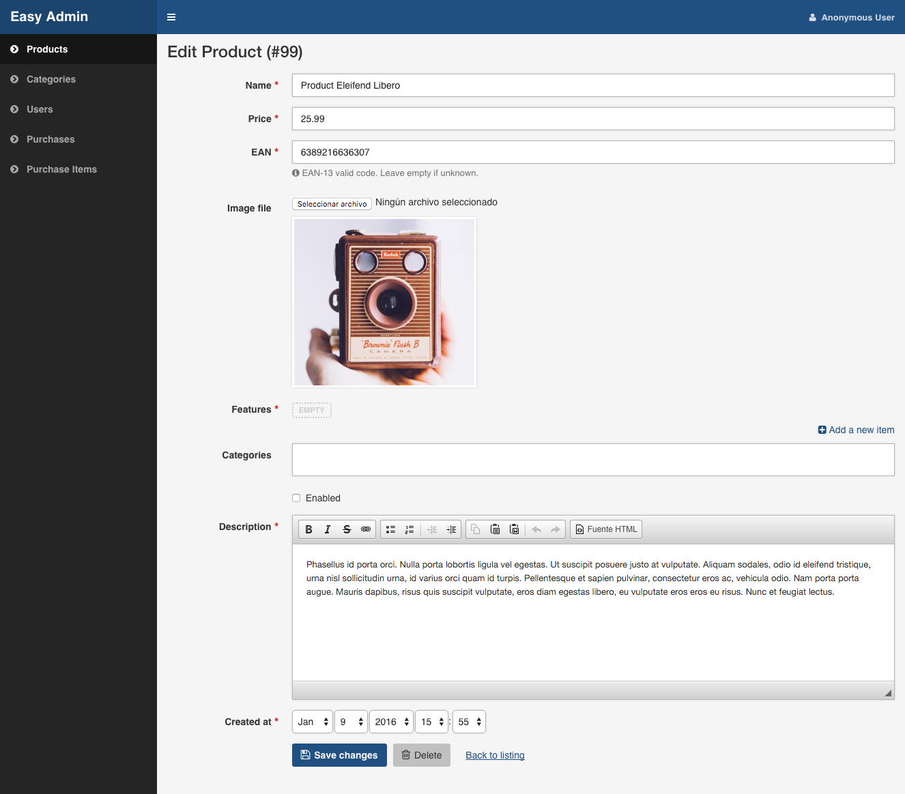
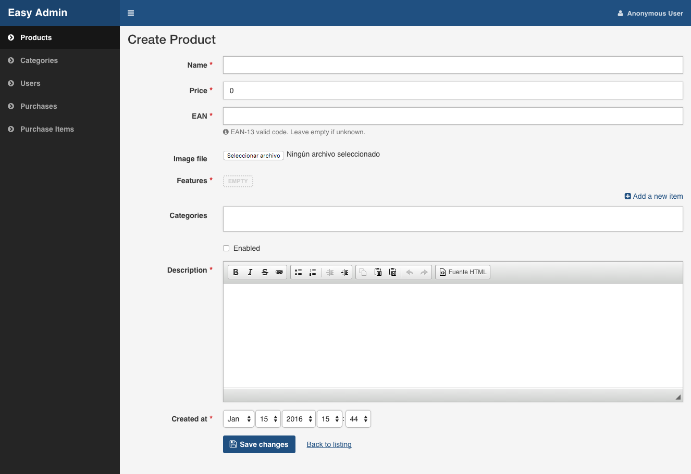
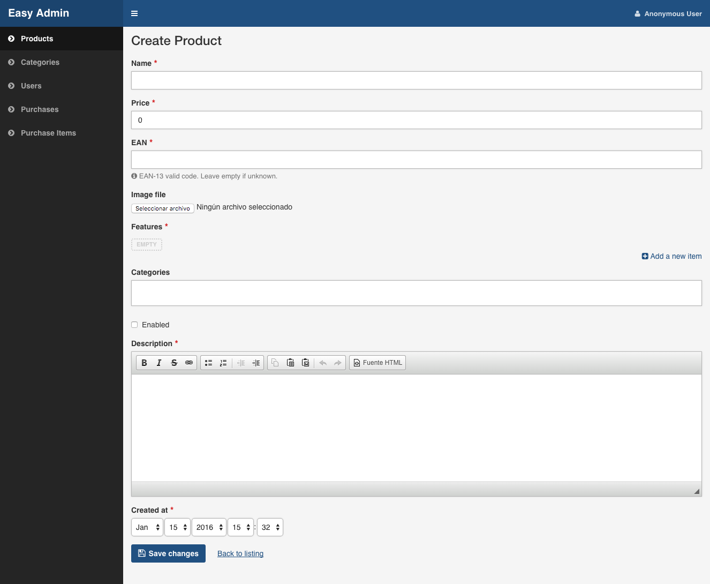
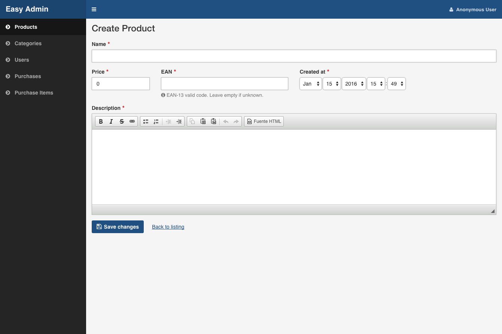

Chapter 4. Edit and New Views Configuration
===========================================

This chaper explains how to customize the `edit` and `new` views. You'll learn
all their configuration options, how to override or tweak their templates and
how to completely override their behavior with custom controllers and Symfony
events.

Edit, New and Form Views
------------------------

The **Edit View** is displayed when modifying the contents of any existing
entity. The **New View** is used when creating new elements of the given entity.
The design of both views is almost identical:



### The Special Form View

Most of the times you apply the same configuration to both `edit` and `new`
views. Instead of duplicating the configuration, you can use the special `form`
view:

```yaml
easy_admin:
    entities:
        Customer:
            class: AppBundle\Entity\Customer
            form:  # <-- 'form' is applied to both 'new' and 'edit' views
                fields:
                    - 'id'
                    - { property: 'email', type: 'email', label: 'Contact' }
                    # ...
    # ...
```

Any option defined in the `form` view is copied into the `new` and `edit` views.
However, any option defined in the `edit` and `new` view overrides the
corresponding `form` option. In other words, always use the `form` action to
define the common configuration, and then use the `new` and `edit` views to
define just the specific options you want to override:

```yaml
easy_admin:
    entities:
        Customer:
            class: AppBundle\Entity\Customer
            form:
                fields: ['id', 'name', 'email']
                title:  'Add customer'
            new:
                fields: ['name', 'email']
            edit:
                title:  'Edit customer'
    # ...
```

The above configuration is equivalent to the following:

```yaml
easy_admin:
    entities:
        Customer:
            class: AppBundle\Entity\Customer
            new:
                fields: ['name', 'email']
                title:  'Add customer'
            edit:
                fields: ['id', 'name', 'email']
                title:  'Edit customer'
    # ...
```

General Configuration
---------------------

In order to make examples more concise, this section only shows the
configuration for the `form` view, but you can apply the same options to the
other `edit` and `new` views.

### Customize the Title of the Page

Page titles display by default the name of the entity. Define the `title` option
to set a custom page title:

```yaml
# app/config/config.yml
easy_admin:
    entities:
        Customer:
            class: AppBundle\Entity\Customer
            label: 'Customers'
            form:
                title: "Add/edit customers"
        # ...
```

The `title` option can include the following special variables:

  * `%entity_label%`, resolves to the value defined in the `label` option of
    the entity. If you haven't defined it, this value will be equal to the
    entity name. In the example above, this value would be `Customers`.
  * `%entity_name%`, resolves to the entity name, which is the YAML key used
    to configure the entity in the backend configuration file. In the example
    above, this value would be `Customer`.
  * `%entity_id%`, it's only available for the `edit` view and it resolves to
    the value of the primary key of the entity being edited. Even if the option
    is called `entity_id`, it also works for primary keys with names different
    from `id`.

Beware that, in Symfony applications, YAML values enclosed with `%` and `%` have
a special meaning (they are considered container parameters). Escape these
variables by doubling the `%` characters:

```yaml
easy_admin:
    entities:
        Customer:
            class: AppBundle\Entity\Customer
            label: 'Customers'
            form:
                title: '%%entity_name%% listing'
        # ...
```

### Customize the Properties Displayed

By default, the `edit` and `new` views display all the entity properties. Use
the `fields` option to explicitly set the properties to display in each view:

```yaml
# app/config/config.yml
easy_admin:
    entities:
        Customer:
            class: AppBundle\Entity\Customer
            form:
                fields: ['firstName', 'lastName', 'phone', 'email']
    # ...
```

This option is useful to reorder the form fields, because by default they are
displayed in the same order as defined in the related Doctrine entity.

> **NOTE**
>
> If any of the fields is an association with another entity, the values of the
> related entity are displayed as a `<select>` list. For that reason, you must
> define the `__toString()` PHP method in any entity which is related to other
> entities. Otherwise you'll see an error message because the backend cannot
> represent the related object as a string.

> **Virtual Properties**
>
> In addition to the real Doctrine properties, the `fields` option can also
> include properties which are not defined in the Doctrine entity. They are
> called "virtual properties" and the only requirement is that they must define
> a *setter* method for them.

Defining Custom Form Options
----------------------------

By default, EasyAdmin only sets the `data_class` option when building the forms
used to create and edit entities:

```php
$form = $this->createFormBuilder($entity, array(
    'data_class' => 'AppBundle\Entity\Customer',
))
-> ...
```

If you need to pass custom options to any form, define the `form_options` option
under the `edit`, `new` or `form` options:

```yaml
easy_admin:
    entities:
        Customer:
            class: AppBundle\Entity\Customer
            form:
                form_options: { validation_groups: ['Default', 'my_validation_group'] }
    # ...
```

This configuration makes the backend to build the forms using the following PHP
code:

```php
$form = $this->createFormBuilder($entity, array(
    'data_class' => 'AppBundle\Entity\Customer',
    'validation_groups' => array('Default', 'my_validation_group'),
))
-> ...
```

Customize the Form Fields
-------------------------

When form fields are not configured explicitly, the backend makes some smart
guesses to display them with the most appropriate widget according to their data
types. If you prefer to control their appearance, start by using the extended
field configuration:

```yaml
# app/config/config.yml
easy_admin:
    entities:
        Customer:
            class: AppBundle\Entity\Customer
            form:
                fields: ['name', { property: 'email', label: 'Contact' }]
    # ...
```

Instead of using a string to define the name of the property (e.g. `'email'`)
you have to define a hash with the name of the property (`{ property: 'email'
}`) and the options you want to define for it (`{ ..., label: 'Contact' }`).

If your entity contains lots of properties, consider using the alternative YAML
syntax for sequences to improve the legibility of your backend configuration.
The following example is equivalent to the above example:

```yaml
# app/config/config.yml
easy_admin:
    entities:
        Customer:
            class: AppBundle\Entity\Customer
            form:
                fields:
                    - name
                    - { property: 'email', label: 'Contact' }
    # ...
```

These are the options that you can define for each field:

  * `property` (mandatory): the name of the entity property which you want to
    set (in `new` view) or modify (in `edit` view). This is the only mandatory
    option when using the extended field configuration format.
  * `label` (optional): the title displayed for the form field. The default
    title is the "humanized" version of the property name (e.g. `published` is
    displayed as `Published` and `dateOfBirth` as `Date of birth`).
  * `help` (optional): the help message displayed below the form field.
  * `css_class` (optional): the CSS class applied to the HTML element which
    contains the entire form field. For example, when using the default
    Bootstrap form theme, this value is applied to the `<div>` element which
    wraps the label, the widget and the error messages of the field.

  * `type` (optional): the Symfony Form type used to render this field. You can
    use the short type name (e.g. `email`) instead of its fully qualified class
    name (e.g. `Symfony\Component\Form\Extension\Core\Type\EmailType`) even if
    your application runs on Symfony 3 (the needed conversion is done internally
    by the bundle).The allowed values are:
    * Any of the [Symfony Form types](http://symfony.com/doc/current/reference/forms/types.html).
    * Any of the custom EasyAdmin form types: `easyadmin_autocomplete` (they are
      explained later in this chapter).
  * `type_options` (optional), a hash with the options passed to the Symfony
    Form type associated with the field.

The `type_options` is the most powerful option because it literally comprises
tens of options suited for each form type:

```yaml
easy_admin:
    entities:
        Customer:
            class: AppBundle\Entity\Customer
            form:
                fields:
                    - 'id'
                    - { property: 'email', type: 'email', type_options: { trim: true } }
                    - { property: 'interests', type_options: { expanded: true, multiple: true } }
                    - { property: 'updated_at', type_options: { widget: 'single_text' } }
```

Read the [Symfony Form type reference](http://symfony.com/doc/current/reference/forms/types.html)
to learn about all the available options, their usage and allowed values.

Formatting Dates and Numbers
----------------------------

### Customizing Date and Time Properties

Unlike the `list`, `search` and `show` views, there are no configuration options
to define the date/time format for `edit` and `new` form fields. You must use
instead the options defined by Symfony's `DateTimeType`, `DateType` and
`TimeType`.

For example, to display your dates as a single `<input>` text element, define
the `widget` form field option (commonly used together with `format`):

```yaml
easy_admin:
    entities:
        Event:
            edit:
                fields:
                    - { property: 'startsAt', type_options: { widget: 'single_text' } }
                    # ...
```

### Customizing Numeric Properties

Similarly, there are no configuration options to define the formatting of the
numeric values for `edit` and `new` views. You must user instead the options
defined by Symfony's `NumberType`, `IntegerType`, `MoneyType` and `PercentType`.

For example, to display a numeric property which stores some price, you can
define the `currency` option of the `MoneyType` form type:

```yaml
easy_admin:
    entities:
        Product:
            edit:
                fields:
                    - { property: 'price', type: 'money', type_options: { currency: 'EUR' } }
                    # ...
```

Custom Doctrine Types
---------------------

When your application defines custom Doctrine DBAL types, you must define a
custom form type for them before using them as form fields. Imagine that your
application defines a `UTCDateTime` type to convert the timezone of datetime
values to UTC before saving them in the database.

If you add that type in a property as follows, you'll get an error message
saying that the `utcdatetime` type couldn't be loaded:

```yaml
easy_admin:
    entities:
        Customer:
            class: AppBundle\Entity\Customer
            form:
                fields:
                    - { property: 'createdAt', type: 'utcdatetime' }
                    # ...
    # ...
```

This problem is solved defining a custom `utcdatetime` Form Type. Read the [How
to Create a Custom Form Field Type][1] article of the official Symfony
documentation to learn how to define custom form types.

EasyAdmin Form Types
--------------------

In addition to the Symfony Form types, fields can use any of the following types
defined by EasyAdmin.

### Autocomplete

It's similar to Symfony's `Entity` type, but the values are loaded on demand via
Ajax based on your input. This type is useful when a field is related to an
entity with lots of database records. Autocompleting those fields improve
backend performance and user experience:

```yaml
easy_admin:
    entities:
        Product:
            class: AppBundle\Entity\Product
            form:
                fields:
                    - { property: 'category', type: 'easyadmin_autocomplete' }
                    # ...
    # ...
```

The `easyadmin_autocomplete` type configures the class of the related entity
automatically. If you prefer to define it explicitly, do it in the type options:

```yaml
# ...
- { property: 'category', type: 'easyadmin_autocomplete', type_options: { class: 'AppBundle\Entity\Category' } }
```

When the user types in an autocomplete field, EasyAdmin performs a fuzzy search
on all the properties of the related entity. This is the same behavior applied
when using the backend search form.

The autocomplete action sends to the browser a JSON array of `{ id: '...', text: '...' }`
tuples. The `id` is stored as the form field value and `text` is the value
displayed to the user.

By default, the entity's primary key is used for the `id` property and the
`(string) %entity` conversion is used for the `text` property. Therefore, you
must define the `__toString()` method in any autocomplete entity.

If you need to customize this behavior, override the `autocompleteAction()` in
the `AdminController` as explained later in this chapter.

Advanced Design Configuration
-----------------------------

### Customizing the Form Theme

By default, forms are displayed using the **horizontal style** defined by the
Bootstrap 3 CSS framework:



The style of the forms can be changed application-wide using the `form_theme`
design option. In fact, the default form style is equivalent to using this
configuration:

```yaml
easy_admin:
    design:
        form_theme: 'horizontal'
    # ...
```

If you prefer to display your forms using the **vertical Bootstrap style**,
change the value of this option to `vertical`:

```yaml
easy_admin:
    design:
        form_theme: 'vertical'
    # ...
```

The same form shown previously will now be rendered as follows:



The `horizontal` and `vertical` values are just nice shortcuts for the two
built-in form themes. But you can also use your own form themes:

```yaml
easy_admin:
    design:
        form_theme: '@AppBundle/form/custom_layout.html.twig'
    # ...
```

The `form_theme` option even allows to define an array of form themes and all of
them will be used when rendering the backend forms:

```yaml
easy_admin:
    design:
        form_theme:
            - '@AppBundle/form/custom_layout.html.twig'
            - 'form_div_layout.html.twig'
    # ...
```

### Multiple-Column Forms

EasyAdmin doesn't support multi-column form layouts. However, you can use the
`css_class` option of each form field to create these advanced layouts:



The configuration used to display this form is the following:

 ```yaml
easy_admin:
    design:
        form_theme: 'vertical'
    entities:
        Product:
            # ...
            form:
                fields:
                    - { property: name, css_class: 'col-sm-12' }
                    - { property: price, type: 'number', css_class: 'col-sm-6' }
                    - { property: 'ean', css_class: 'col-sm-6' }
                    - { property: 'enabled', css_class: 'col-sm-12' }
                    - { property: 'description', css_class: 'col-sm-12' }
    # ...
```

### Default Templates

EasyAdmin defines seven Twig templates to create its interface. These are the
four templates related to `edit` and `new` views:

  * `layout`, the common layout that decorates the `list`, `edit`, `new` and
    `show` templates;
  * `new`, renders the page where new entities are created;
  * `edit, renders the page where entity contents are edited;
  * `form`, renders the form of the `new` and `edit` views.

Depending on your needs you can override these templates in different ways.

### Selecting the Template to Render

These are all the configuration options and paths checked before selecting the
template to render (the first template which exists is used):

  1. `easy_admin.entities.<EntityName>.templates.<TemplateName>` configuration
     option.
  2. `easy_admin.design.templates.<TemplateName>` configuration option.
  3. `app/Resources/views/easy_admin/<EntityName>/<TemplateName>.html.twig`
  4. `app/Resources/views/easy_admin/<TemplateName>.html.twig`
  5. `@EasyAdmin/default/<TemplateName>.html.twig`

The last one is the template path of the built-in templates and they are always
available. The following sections explain the first four ways to customize the
templates used by the backend.

#### Overriding the Default Templates By Configuration

If you prefer to define the custom templates in some specific location of your
application, it's more convenient to use the `templates` option.

For example, to override the `edit` template just for the `Customer` entity,
create the `edit.html.twig` template somewhere in your application and then,
configure its location with the `templates` option:

```yaml
easy_admin:
    entities:
        Customer:
            # ...
            templates:
                paginator: 'UserBundle:Backend:edit.html.twig'
                # namespace syntax works too:
                # paginator: '@User/Backend/edit.html.twig'
```

Similarly, to override some template for all entities, define the `templates`
option under the global `design` option:

```yaml
easy_admin:
    design:
        templates:
            edit: 'AppBundle:Backend:edit.html.twig'
            # namespace syntax works too:
            # paginator: '@App/Backend/edit.html.twig'
    entities:
        # ...
```

#### Overriding the Default Templates By Convention

If you don't mind the location of your custom templates, consider creating them
in the `app/Resources/views/easy_admin/` directory. When the `templates` option
is not defined, EasyAdmin looks into this directory before falling back to the
default templates.

For example, to override the `edit` template just for the `Customer` entity,
you only need to create this template in this exact location (there is no need
to define the `templates` configuration option):

```
your-project/
├─ app/
│  ├─ ...
│  └─ Resources/
│     └─ views/
│        └─ easy_admin/
│           └─ Customer/
│              └─ edit.html.twig
├─ src/
├─ vendor/
└─ web/
```

In case you want to override the template for all entities, define the new
template right under the `easy_admin/` directory:

```
your-project/
├─ app/
│  ├─ ...
│  └─ Resources/
│     └─ views/
│        └─ easy_admin/
│           └─ edit.html.twig
├─ src/
├─ vendor/
└─ web/
```

Customizing the Behavior of `edit` and `new` Views
--------------------------------------------------

In the previous sections you've learned how to override or tweak the templates
of each view. However, this mechanism is somewhat limited for `edit` and `new`
views because they really depend on the Symfony Form component styling.

Moreover, for form-related views, the most useful customization is to tweak how
entities are created, persisted or removed. For these cases, EasyAdmin provides
a more advanced customization mechanism based on PHP to customize the behavior
of the backend.

Depending on your needs you can choose any of these two customization options
(or combine both, if your backend is very complex):

  * Customization based on **controller methods**, which is easy to set up but
    requires you to put all the customization code in a single controller which
    extends from the default `AdminController` provided by EasyAdmin.
  * Customization based on **Symfony events**, which is harder to set up but
    allows you define the customization code anywhere in your application.

### Customization Based on Controller Methods

This technique requires you to create a new controller in your Symfony
application and make it extend from the default `AdminController`. Then you
just add one or more methods in your controller to override the default ones.

The first step is to **create a new controller** anywhere in your Symfony
application. Its class name or namespace doesn't matter as long as it extends
the default `AdminController`:

```php
// src/AppBundle/Controller/AdminController.php
namespace AppBundle\Controller;

use JavierEguiluz\Bundle\EasyAdminBundle\Controller\AdminController as BaseAdminController;

class AdminController extends BaseAdminController
{
}
```

Then you must **update the routing configuration** to associate the `easyadmin`
route to the new controller. Open the `app/config/routing.yml` file and change
the `resource` option of the `easy_admin_bundle` route:

```yaml
# app/config/routing.yml
easy_admin_bundle:
    # resource: "@EasyAdminBundle/Controller/"           <-- REMOVE this line
    resource: "@AppBundle/Controller/AdminController.php" # <-- ADD this line
    type:     annotation
    prefix:   /admin
```

Save the changes and the backend will start using your own controller. Keep
reading the practical examples of the next sections to learn which methods you
can override in the controller.

### Customize the Instantiation, Persistence and Removal of All Entities

EasyAdmin executes the simplest possible code when creating, editing, persisting
and deleting entities. For example, this is the code used to create new entities
before passing them to the form displayed by the `new` view:

```php
protected function createNewEntity()
{
    $entityClass = $this->entity['class'];

    return new $entityClass();
}
```

Most of the times this code is enough to instantiate your entities, but if any
of the entities requires some arguments for its constructor, this code will
result in an exception.

For that reason, EasyAdmin lets you customize any method used to create, persist,
edit and delete entities. Moreover, you can also customize utility methods used
to create the form builders, define the form options, etc.

These are all the methods you can define in your own controller to override the
default methods used by the backend:

```php
// src/AppBundle/Controller/AdminController.php
namespace AppBundle\Controller;

use JavierEguiluz\Bundle\EasyAdminBundle\Controller\AdminController as BaseAdminController;

class AdminController extends BaseAdminController
{
    // This method is executed when the user performs a 'new' action on an entity
    // @return Response
    protected function newAction();

    // This method is executed when the user performs a 'edit' action on an entity
    // @return Response
    protected function editAction();

    // Creates a new object of the current managed entity
    // @return object
    protected function createNewEntity();

    // Modify the entity being created before persisting it
    // @return null
    protected function prePersistEntity($entity);

    // Modify the entity being edited before saving the changes
    // @return null
    protected function preUpdateEntity($entity);

    // Modify the entity being deleted before removing it
    // @return null
    protected function preRemoveEntity($entity);

    // Returns the form used to create an entity
    // @return Form
    protected function createNewForm($entity, array $entityProperties);

    // Returns the form used to edit an entity
    // @return Form
    protected function createEditForm($entity, array $entityProperties);

    // Returns the form object used to create or edit the entity
    // @return Form
    protected function createEntityForm($entity, array $entityProperties, $view);

    // Returns the form builder of the form used to create or edit the entity
    // @return FormBuilder
    protected function createEntityFormBuilder($entity, $view);

    // Returns the list of form options before sending them to the form builder
    // @return array
    protected function getEntityFormOptions($entity, $view);

    // Returns the form used to delete an entity
    // @return Form
    protected function createDeleteForm($entityName, $entityId);
}
```

Inside these methods you can access to the properties set during the execution
of the `initialize()` method:

  * `$this->config`, an array with the entire backend configuration;
  * `$this->entity`, an array with the configuration for the current entity;
  * `$this->request`, a Symfony `Request` object which represents the current
    request;
  * `$this->em`, an instance of the Doctrine Entity Manager associated with
    the current entity.

### Customize the Instantiation, Persistence and Removal of Some Entities

In addition to the methods showed in the previous section, your controller can
also define methods which are executed just for some specific entity. The only
requirement is to use the following syntax for the method names:

  * `create<EntityName>EntityFormBuilder()`
  * `create<EntityName>NewForm()`
  * `createNew<EntityName>Entity()`
  * `get<EntityName>EntityFormOptions()`
  * `prePersist<EntityName>Entity()`
  * `preRemove<EntityName>Entity()`

> **TIP**
>
> Given the syntax of method names, it's recommended to use CamelCase notation
> to set the entity names.

The following example shows some of these methods in action:

```php
// src/AppBundle/Controller/AdminController.php
namespace AppBundle\Controller;

use JavierEguiluz\Bundle\EasyAdminBundle\Controller\AdminController as BaseAdminController;

class AdminController extends BaseAdminController
{
    // Customize the creation of entities only for 'User'
    public function createNewUserEntity()
    {
        return new User(array('ROLE_USER'), true);
    }

    // update the `slug` when editing a blog post
    public function preUpdateBlogPostEntity($entity)
    {
        $slug = $this->get('slugger')->slugify($entity->getTitle());
        $entity->setSlug($slug);
    }

    // send an email to the editor when a blog a post is removed
    public function preRemoveBlogPostEntity($entity)
    {
        $subject = sprintf('Blog Post Removed: %s', $entity->getTitle());
        $this->get('mailer')->send(...);
    }
}
```

### Customization Based on Symfony Events

Lots of events are triggered during the execution of each backend action. Use
Symfony's event listeners or event subscribers and hook to these events to
modify the behavior of your backend.

EasyAdmin events are defined in the `EasyAdmin\Event\EasyAdminEvents` class
and these are the most relevant events for `edit` and `new` views.

#### Initialization related events

The `initialize()` method is executed before any other action method
(`editAction()`, etc.) It checks for some common errors and initializes the
variables used by the rest of the methods (`$entity`, `$request`, `$config`,
etc.)

The two events related to this `initialize()` method are:

  * `PRE_INITIALIZE`, executed just at the beginning of the method, before any
    variable has been initialized and any error checked.
  * `POST_INITIALIZE`, executed at the very end of the method, just before
    executing the method associated with the current action.

#### Views related events

Each view defines two events which are dispatched respectively at the very
beginning of each method and at the very end of it, just before executing the
`$this->render()` instruction:

  * `PRE_EDIT`, `POST_EDIT`
  * `PRE_NEW`, `POST_NEW`

#### Doctrine related events

Doctrine related logic is wrapped with a before and after event that allows you
to tweak the entity being created/updated/removed:

  * `PRE_PERSIST`, `POST_PERSIST`
  * `PRE_UPDATE`, `POST_UPDATE`
  * `PRE_REMOVE`, `POST_REMOVE`

#### The Event Object

Event listeners and subscribers receive an event object based on the
[GenericEvent class][2] defined by Symfony. The subject of the event is the
current `$entity` object (this object is also available in the event arguments
as `$event['entity']`).

In addition, the event arguments contain all the action method variables. You
can access to them through the `getArgument()` method or via the array access
provided by the `GenericEvent` class.

#### Event Subscriber Example

The following example shows how to use an event subscriber to set the `slug`
property of the `BlogPost` entity before persisting it:

```php
namespace AppBundle\EventListener;

use Symfony\Component\EventDispatcher\EventSubscriberInterface;
use Symfony\Component\EventDispatcher\GenericEvent;
use AppBundle\Entity\BlogPost;

class EasyAdminSubscriber implements EventSubscriberInterface
{
    private $slugger;

    public function __construct($slugger)
    {
        $this->slugger = $slugger;
    }

    public static function getSubscribedEvents()
    {
        return array(
            'easy_admin.pre_persist' => array('setBlogPostSlug'),
        );
    }

    public function setBlogPostSlug(GenericEvent $event)
    {
        $entity = $event->getSubject();

        if (!($entity instanceof BlogPost)) {
            return;
        }

        $slug = $this->slugger->slugify($entity->getTitle());
        $entity->setSlug($slug);

        $event['entity'] = $entity;
    }
}
```

-------------------------------------------------------------------------------

&larr; [Chapter 3. List, Search and Show Views Configuration](3-list-search-show-configuration.md)  |  [Chapter 5. Actions Configuration](5-actions-configuration.md) &rarr;

[1]: http://symfony.com/doc/current/cookbook/form/create_custom_field_type.html
[2]: http://symfony.com/doc/current/components/event_dispatcher/generic_event.html
