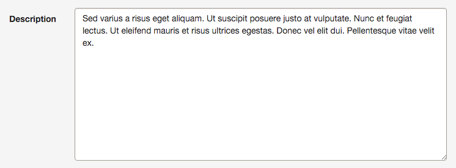
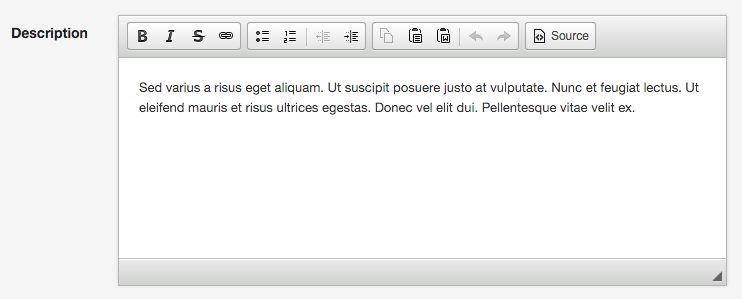
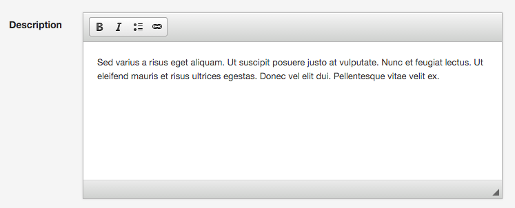

How to Use a WYSIWYG Editor
===========================

EasyAdmin uses a `<textarea>` form field to render long text properties:



However, sometimes you need to provide to your users a rich editor, commonly
named *WYSIWYG editor*. Although EasyAdmin doesn't provide any built-in rich text
editor, you can integrate one very easily.

Installing the Rich Text Editor
-------------------------------

The recommended WYSIWYG editor is called [CKEditor](http://ckeditor.com/) and
you can integrate it thanks to the [IvoryCKEditorBundle](https://github.com/egeloen/IvoryCKEditorBundle):

1) Install the bundle:

```bash
$ composer require egeloen/ckeditor-bundle
```

2) Enable the bundle:

```php
// app/AppKernel.php
class AppKernel extends Kernel
{
    public function registerBundles()
    {
        return array(
            // ...
            new Ivory\CKEditorBundle\IvoryCKEditorBundle(),
        );
    }
}
```

3) Install the JavaScript/CSS files used by the bundle:

```bash
# Symfony 2
php app/console assets:install --symlink

# Symfony 3
php bin/console assets:install --symlink
```

Using the Rich Text Editor
--------------------------

IvoryCKEditorBundle provides a new form type called `ckeditor`. Just set the
`type` option of any property to this value to display its contents using a
rich text editor:

```yaml
easy_admin:
    entities:
        Product:
            # ...
            form:
                fields:
                    # ...
                    - { property: 'description', type: 'ckeditor' }
```

> **TIP**
>
> Even if your application uses Symfony 3 there is no need to use the FQCN of
> the `CKEditorType` (`type: 'Ivory\CKEditorBundle\Form\Type\CKEditorType'`)
> because EasyAdmin supports the short types for some popular third-party bundles.

Now, the `description` property will be rendered as a rich text editor and not as
a simple `<textarea>`:



Customizing the Rich Text Editor
--------------------------------

EasyAdmin tweaks some CKEditor settings to improve the user experience. In case
you need further customization, configure the editor globally in your Symfony
application under the `ivory_ck_editor` option. For example:

```yaml
# app/config/config.yml
ivory_ck_editor:
    input_sync: true
    default_config: base_config
    configs:
        base_config:
            toolbar:
                - { name: "styles", items: ['Bold', 'Italic', 'BulletedList', 'Link'] }

easy_admin:
    entities:
        Product:
            # ...
            form:
                fields:
                    # ...
                    - { property: 'description', type: 'ckeditor' }
```

In this example, the toolbar is simplified to display just a few common options:



Alternatively, you can also define the editor options in the `type_options`
setting of the property:

```yaml
easy_admin:
    entities:
        Product:
            # ...
            form:
                fields:
                    # ...
                    - { property: 'description', type: 'ckeditor', type_options: { 'config': { 'toolbar': [ { name: 'styles', items: ['Bold', 'Italic', 'BulletedList', 'Link'] } ] } } }
```

This inline configuration is very hard to maintain, so it's recommended to use
the global configuration instead. You can even combine both to define the toolbars
globally and then select the toolbar to use in each property:

```yaml
# app/config/config.yml
ivory_ck_editor:
    input_sync: true
    default_config: simple_config
    configs:
        simple_config:
            toolbar:
                # ...
        advanced_config:
            toolbar:
                # ...

easy_admin:
    entities:
        Product:
            # ...
            form:
                fields:
                    # ...
                    - { property: 'excerpt', type: 'ckeditor',
                        type_options: { config_name: 'simple_config' } }
                    - { property: 'description', type: 'ckeditor',
                        type_options: { config_name: 'advanced_config' } }
```

Check out the original CKEditor documentation to get
[its full list of configuration options] (http://docs.cksource.com/ckeditor_api/symbols/CKEDITOR.config.html).

Integrating CKFinder
--------------------

[CKFinder](https://cksource.com/ckfinder) is a file manager plugin developed for
CKEditor. First, follow its documentation to download and install the "CKFinder
Connector" somewhere in your Symfony application. After that, integrating
CKFinder with CKEditor is a matter of adding a few lines of JavaScript code.

First, create a JavaScript file (for example in `web/js/setup-ckfinder.js`) and
add the following code:

```js
window.onload = function () {
    if (window.CKEDITOR){
        // configure 'connectorPath' according to your own application
        CKFinder.config( { connectorPath: '/app.php/ckfinder/connector' } );
        for (var ckInstance in CKEDITOR.instances){
            CKFinder.setupCKEditor(CKEDITOR.instances[ckInstance]);
        }
    }
}
```

Then, use the `design.assets.js` config option to include that file in every
page loaded by EasyAdmin:

```yaml
easy_admin:
    design:
        assets:
            js:
                - '/bundles/cksourceckfinder/ckfinder/ckfinder.js'
                - '/js/setup-ckfinder.js'
                # ...
```
